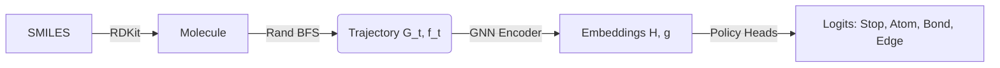

# MIT6.8700-FP

Experimentation with transformer-based actor models and transfer learning Transfer learning using teacher-student learning with tunable hybrid loss function (soft target and label loss).

Transformer model performed as well, if not better, than RNN model at lower actor learning rates. Performance may improve with greater batch size and training steps.

Must be run within original SMILES-RL env* https://github.com/MolecularAI/SMILES-RL/tree/main

The knowledge transfer process is defined in the mrun.py file. It requires the instantiation of a ModelDistillation class in the distill.py file.

The initial model must be run with the prior file located in the original SMILES-RL page at all times.


# Updated Code Overview

This short guide lists the code-only changes and how to use them without bundling any model weights.

## Distillation (RNN → Transformer)
- Code: `distill.py`, `check_distillation.py`, `smiles_rl/model/actor_model_transformer.py`
- Diagnostics: `diagnose_distilled.py`
- RL wiring: `config_a2c_transformer_student.json`, `run.py`, `smiles_rl/agent/a2c.py`
- How to run distill:
  ```bash
  python check_distillation.py \
    --teacher <path_to_teacher_rnn_prior> \
    --student_weights <output_student_weights.pth> \
    --batch_size 200 --steps 10000 --lr 1e-5 --alpha 0.1 --temp 0.99 \
    --d_model 512 --n_layers 6 --n_heads 8 --dropout 0.0 --freeze_embeddings
  ```
  Supply your own teacher and output paths; no weights are bundled.

## Transformer/GPT Pretraining (ChemBL + ZINC)
- Code: `pretrain_supervised.py`, `smiles_rl/model/actor_model_transformer.py`, `data/dataset.py`, `diagnose_model.py`
- Optional download helpers (pull external weights): `download_molgpt.py`, `download_small_molgpt.py`, `fix_small_molgpt*.py`
- How to run pretraining:
  ```bash
  python pretrain_supervised.py \
    --data data/smiles_corpus.smi \
    --prior <path_to_rnn_prior_with_vocab> \
    --save-dir results_transformer_pretrain \
    --epochs 5 --batch-size 256 --lr 1e-4 \
    --d-model 512 --n-layers 6 --n-heads 8 --dropout 0.0 --max-length 256
  ```
  Provide your own SMILES data and prior; no pretrained weights are included.

## RL with Transformer Actor
- Config example: `config_a2c_transformer_student.json`
- Runners: `run.py`, `run_transformer.py`, `mrun.py`
- Agent: `smiles_rl/agent/a2c.py`
- Set `actor_type: "transformer"` and point `transformer_weights` to your trained/distilled checkpoint. Ensure `transformer_network` matches your checkpoint shape or omit it to read shapes from the checkpoint.

## Transformer/Non-RNN Models (under `smiles_rl/model`)
- `actor_model_transformer.py` — transformer actor wrapper (student/actor)
- `actor_model_gpt2.py` — GPT-2/MolGPT actor wrapper
- `actor_model.py` — RNN actor (reference)
- `transformer.py` — decoder-only transformer backbone
- `critic_model_transformer.py` — transformer-based critic
- `critic_molgpt.py` — critic for GPT-2/MolGPT tokenizers
- `actor_model_transformer` dependencies: `utils/layers.py` (transformer layers), `vocabulary.py`, `smiles_tokenizer.py`

## Notes
- No model weights are shipped; all paths to teacher/student/pretrained weights must be supplied by you.
- Vocab/tokenizer compatibility: use the same prior for actor and critic to avoid mismatches.
## Graph Convolutional Policy Network (GCPN)

A PyTorch implementation of a graph-generative policy network for drug-like molecule creation. This model treats molecule generation as a sequential decision process on a graph $G_t$, enforcing chemical validity via valence constraints.

### 🧠 Methodology

### 1. Trajectory Generation
We convert SMILES into supervised training trajectories $\{(G_t, f_t, a_t)\}$ using **Randomized Breadth-First Search (BFS)**:
* **Initialization:** Select random start atom ($G_0$).
* **Expansion:** Maintain a queue of "focus nodes" ($f_t$).
* **Actions:** `add_atom` (expand to neighbor), `add_bond` (ring closure), or `stop`.

### 2. Model Architecture
**Encoder:** An $L$-layer GNN (GCN/GAT backbone) processes node features $\mathbf{X}$ into node embeddings $\mathbf{H}$ and a pooled graph embedding $\mathbf{g}$.

**Policy Heads:**
The action space is decomposed into 5 MLP heads:
1.  **Stop:** $\ell_{\text{stop}}(\mathbf{g})$ (Binary probability)
2.  **Atom Type:** $\ell_{\text{atom}}(\mathbf{g})$ (Element prediction)
3.  **Bond Order:** $\ell_{\text{addbond}}(\mathbf{h}_f)$ (Bond type to parent)
4.  **Ring Closure:** $\ell_{\text{edge}}$ & $\ell_{\text{bond}}$ (Score existing nodes for connection)

### 3. Constraints & Optimization
* **Valence Masking:** Logits for chemically invalid connections are masked with $-\infty$ based on current node degree $\deg(v)$ and $\text{MaxValence}(z)$.
* **Objective:** We optimize a multi-task supervised loss:

```math
\mathcal{L} = \mathcal{L}_{\text{stop}} + \mathcal{L}_{\text{atom}} + \mathcal{L}_{\text{addbond}} + \mathcal{L}_{\text{edge}} + \mathcal{L}_{\text{bond}}
```

### 📐 Pipeline Overview


## Installation
After SMILES-RL setup, switch to the conda environment within the GCPN folder:

```python
conda deactivate
cd GCPN
conda env create -f env.yml
conda activate gcpn_env
```

## Usage

### Training GCPN
If you want to retrain the model, run the following command:
```python
python GCPN/pretrain.py
```
The file gcpn_prior.pt should be generated. The checkpoints are saved in GCPN/checkpoints in case the training fails. 

### Generation
```python
python GCPN/generate_gcpn.py
```

### Training Agent
```python
python GCPN/ppo_gcpn.py
```


